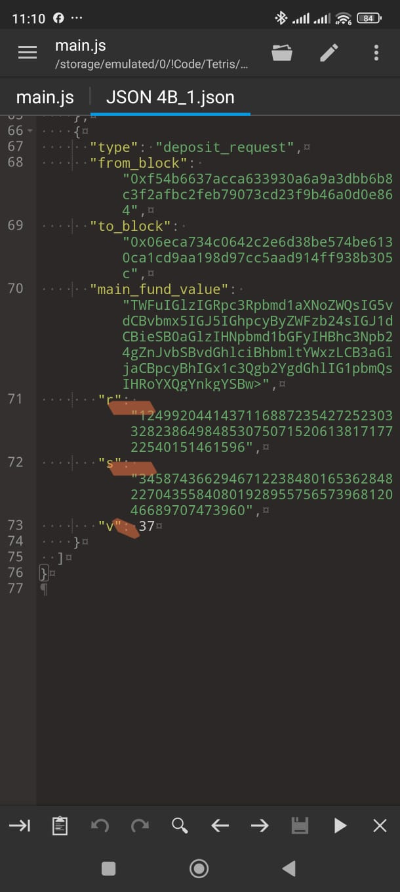
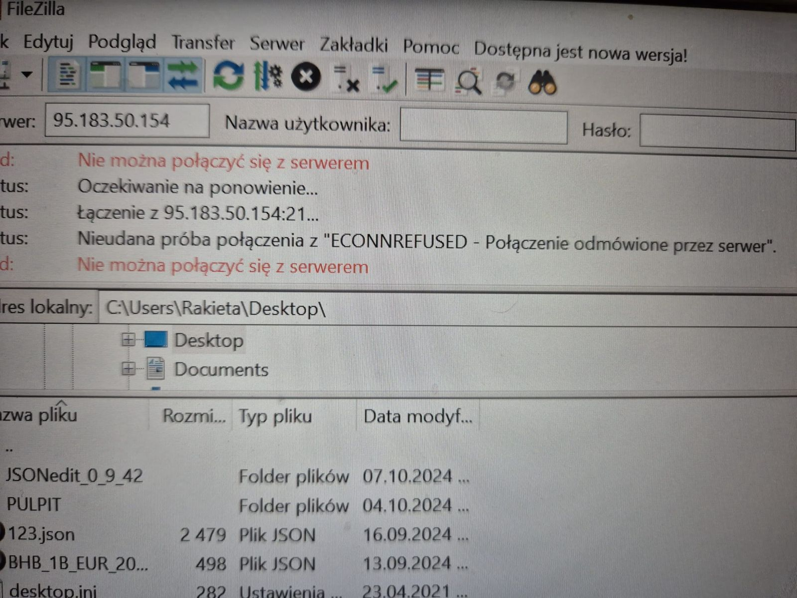
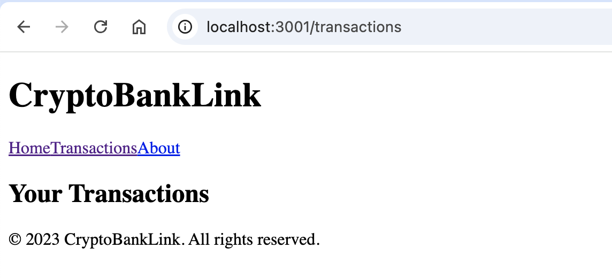
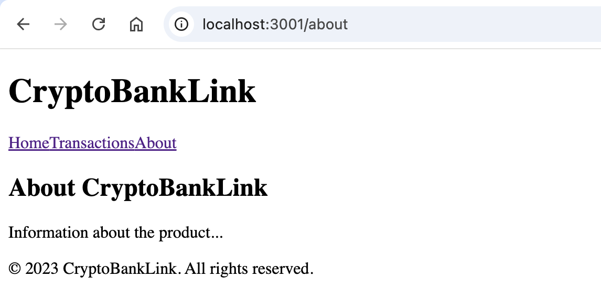

# Crypto Host

> `gpg --symmetric --cipher-algo AES256 --passphrase 'your_password' --output JSON_4B_1.json.gpg JSON_4B_1.json`

To prepare a modified JSON file that is suitable for interaction with the UI in a NEXT.js environment and facilitates transactions via an API (Postman) while interacting with the crypto blockchain, we'll structure the JSON data in a straightforward manner. Here’s a more intuitive version of your original JSON that reflects the required attributes and can work well for web interface interaction.




```json
{
  "transaction_type": "crypto_transaction",
  "sender": {
    "account_number": "0582505400",
    "account_name": "HDH-Nord-Bau GmbH",
    "iban": "DE58200700000582505400",
    "bank_name": "DEUTSCHE BANK AG",
    "bank_wallet": {
      "local_address": "0x5754284f345afc66a98fbB0a0Afe71e0F007B949",
      "current_balances": {
        "USDT": "5,379,069,841.78",
        "EUR": "4,896,689,800.00"
      },
      "supported_networks": [
        "ERC20",
        "TRC20",
        "BEP20"
      ],
      "bank_url": "https://www.deutsche-bank.de/pk/topangebote/topangebote-sea.html?kid=e.0400.00.01&gad_source=1&gbraid=0AAAAACqAfnSL5Gsk-o8T6dHmsEzA-r__r&gclid=0x49D758c9aFE9755f6b6519a33992de96230197cC"
    },
    "status": "active"
  },
  "transaction_details": {
    "type": "deposit_request",
    "from_block": "0x56ab67c6339030a68123c4e2d2be690b1cb93745",
    "to_block": "0x0e06c2734632c3f1b3d1e74be576d8e5167c5af2",
    "fund_value": {
      "amount": "10000",
      "currency": "USDT"
    },
    "version": "1.0"
  }
}
```
## Explanation of the JSON Structure

- `transaction_type`: Indicates the type of transaction, here it's a crypto transaction.
- `sender`: Contains all information related to the sender, including account details.
- `bank_wallet`: Holds details about the crypto wallet such as the local address, current balances (for USDT and EUR), supported networks (for easy understanding), and the link to the bank's official webpage.
- `transaction_details`: This is where specifics about the transaction are described:
  - `from_block` and `to_block`: Used for specifying the blockchain addresses involved.
  - `fund_value`: The amount being transacted and its currency.
  - `version`: Represents the version of the transaction details, for clarity in the API.

## Notes

- The balance fields have been simplified to directly show the amounts.
- Using arrays for supported networks creates a more manageable structure for your future enhancements and interactions.
- Make sure that your API and blockchain integrations handle the data types, especially for large numbers like balances.

This JSON structure should be understandable to someone in 10th grade and facilitate transactions effectively through the required API. Feel free to ask if you need further modifications or explanations!

# Web-UI v0






